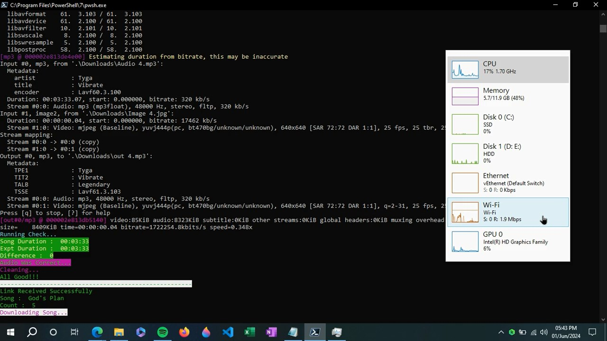
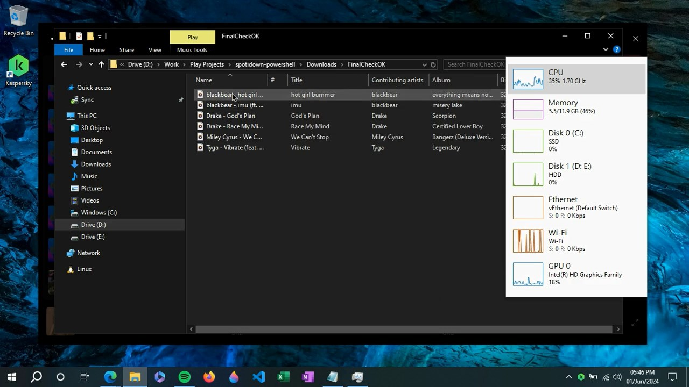
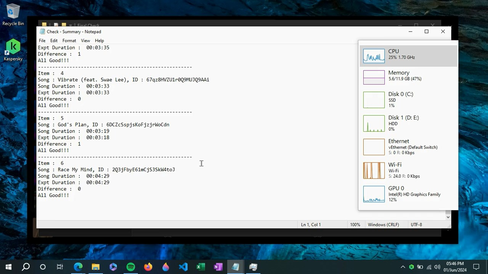

image::./Docs/logo.png[width=128, height=128] 
= ***SpotiDown - PowerShell***

IMPORTANT: The API Utilized In This Project Is No Longer Reliable, As It Now Delivers Audio Chunks Instead Of Complete Songs. Furthermore, The API Structure Underwent Significant Changes, Introducing Token-based Authentication. Consequently, This Project Is No Longer Functional Under The Updated API Framework.

== Project Status

....
Completed
....

'''

== Features

. This Project Downloads Spotify Playlist Using API Scrapped From #spotidownloader.com#
. Validating File To Ensure Only Audio With Accurate Time Parameters Is Allowed, Preventing Incorrect Song Downloads

'''

== Technology Stack And Tools

[cols="1,1"]
|===
|Name|Version

|Powershell
|5.1

|Windows 10 - x64
|Version 22H2
|===

'''

== Install/Execute

TIP: Walkthrough Video Is Provided Inside Docs Folder

. Extract FFMpeg From #Tool# Folder And Paste It There Itself
. Make Sure To Export Your Spotify Playlist In CSV And Rename It #Details.csv#
. Filter The CSV As Shown In Video
. Downloading Songs :
[source, powershell]
powershell -executionpolicy bypass -File '.\Download.ps1' -sno 0 -eno 0
. Performing Final Check : 
[source, powershell]
powershell -executionpolicy bypass -File '.\Check.ps1' -sno 0 -eno 0 | Out-File -FilePath 'Check - Summary.txt'
. Your Final Downloaded Files Will Be Inside #Downloads\FinalCheckOK#

'''

== Special Note

Temporary File Generated While Downloading Or Checking Contains List Of File Names That Were Not Successful. Commands Are Mentioned Below Each List Item, That Needs To Be Pasted On Powershell In Order To Retry.

'''

== Common Issues

.Audios Downloading At Very Slow Speed
[%collapsible]
====
....
Keep Restarting The Program Until Optimal Download Speed Is Achieved
....
====

.Program Terminates At Start
[%collapsible]
====
....
sno And eno Are Not Correctly Configured
....
====

'''

== Gallery

====
 
 
 
====

'''

== Author

....
Mrigayan
....

